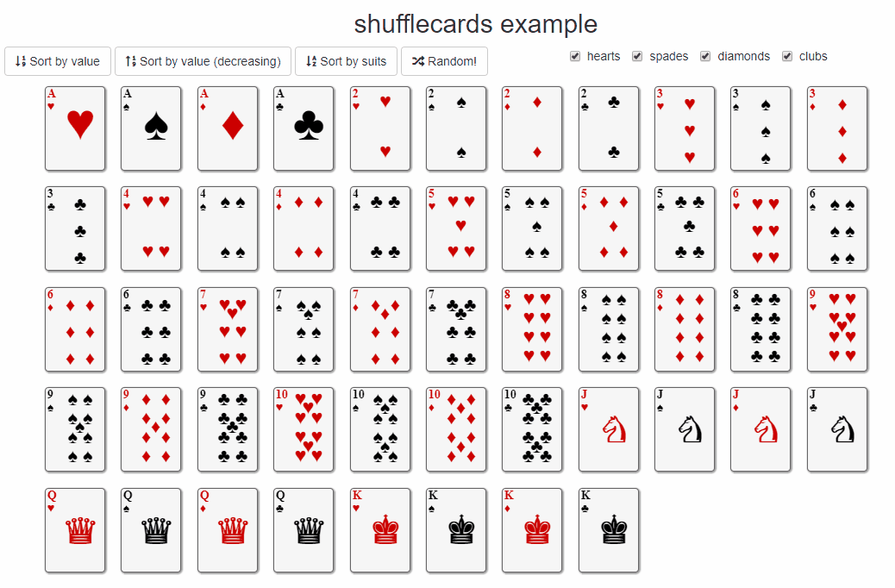

# shufflecards 

> Filter and sort grid layouts in Shiny application and Markdown document with [Shuffle.js](https://github.com/Vestride/Shuffle).


[](https://travis-ci.org/dreamRs/shufflecards)
[](https://www.repostatus.org/#wip)


## Installation

You can install `shufflecards` from GitHub:

```r
# with remotes
remotes::install_github("dreamRs/shufflecards")

# or with install-github.me service (based on remotes)
source("https://install-github.me/dreamRs/shufflecards")

# or with devtools:
devtools::install_github("dreamRs/shufflecards")
```

## Example

In markdown:

* With an `htmlwidget` : https://dreamrs.github.io/tweets-transports/
* With HTML tags : https://dreamrs.github.io/shufflecards



(You can replace cards by plots or whatever you want :) )
