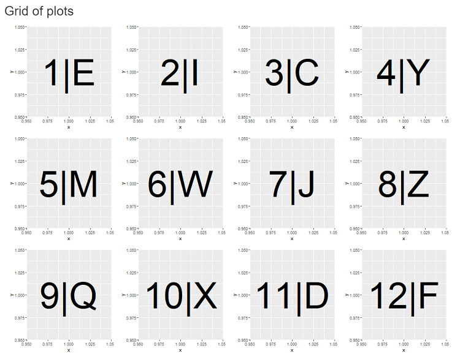

```{r, include = FALSE}
knitr::opts_chunk$set(
  collapse = TRUE,
  comment = "#>", 
  eval = FALSE
)
```

```{r setup, eval=TRUE, warning=FALSE, message=FALSE}
library(shufflecards)
library(dplyr)
```


### Create a grid

To create a Shuffle grid in a Shiny application, use the function `shuffle_container` in the UI part of the application : 

```{r}
shuffle_container(
  shuffleId = "mygrid",
  ...
)
```

Argument `shuffleId` is mandatory, it will be necessary for reference to the grid from the server.

The `...` is where to add cards to the grid.


### Add cards


Creating a card is done with function `shuffle_card`, you can pass UI components (such as Shiny ouput functions) to a card and define some properties, here an example for one card :

```{r}
shuffle_card(
  id = "card1",
  value_num = 1,
  value_char = "H",
  plotOutput(
    outputId = "plot1",
    height = "250px",
    width = "250px"
  )
)
```

The `id` attribute will be use to filter cards in the grid, `value_num` and `value_char` are custom attributes that we'll use for sorting the grid.

The card will contain a plot with fixed height and width, declared in `plotOutput` (it will be necessary to add a `renderPlot` in the server), the goal here is to produce a grid of small plots.


Now, include the card in the main container : 

```{r}
shuffle_container(
  shuffleId = "mygrid",
  shuffle_card(
    id = "card1",
    value_num = 1,
    value_char = "H",
    plotOutput(
      outputId = "plot1",
      height = "250px",
      width = "250px"
    )
  ),
  shuffle_card(
    id = "card2",
    value_num = 2,
    value_char = "F",
    plotOutput(
      outputId = "plot2",
      height = "250px",
      width = "250px"
    )
  ),
  ...
)
```


It's also possible to add a list of cards, created with `lapply` or `purrr`.


Result looks like this (by adding some `ggplot2` plots) :




Launch this example with:

```{r}
run_example("grid-plot")
```


### Sort the grid

Two attributes have been defined:

 * `value_num` : a numeric between 1 and 12
 * `value_char` : a random letters
 
We can sort the grid according those two.

First, we add a classic Shiny input in the UI :

```{r}
radioButtons(
  inputId = "sort",
  label = "Sort by:",
  choices = c(
    "Ascending order (numeric)",
    "Descending order (numeric)",
    "Ascending order (character)",
    "Descending order (character)",
    "Random!"
  )
)
```


In the server, we can sort the grid by using function `arrange_cards`, first argument is the `shuffleId` of the grid, second is the attribute on which perform the sorting, we can create an `observe` depending on the input defined above :

```{r}
observe({
  if (input$sort == "Ascending order (numeric)") {
    
    arrange_cards("bsgrid", "value_num")
    
  } else if (input$sort == "Descending order (numeric)") {
    
    arrange_cards("bsgrid", "value_num", desc = TRUE)
    
  } else if (input$sort == "Ascending order (character)") {
    
    arrange_cards("bsgrid", "value_char")
    
  } else if (input$sort == "Descending order (character)") {
    
    arrange_cards("bsgrid", "value_char", desc = TRUE)
    
  } else{
    
    randomize_cards("bsgrid")
    
  }
})
```


Each time the value of `radioButtons` change, the grid will be sorted.


### Filter the grid

To filter the grid, we can use the `id` of each card, and declare `id`s we want to kept inside function `filter_cards`.

We start by creating a `data.frame` with all our cards attributes : 

```{r, eval=TRUE}
is.even <- function(x) x %% 2 == 0

cards_data <- tibble(
  num = 1:12,
  id = paste0("card", num),
  type = if_else(is.even(num), "even", "odd")
)
cards_data
```


We can now filter this `tibble` to keep only cards we want, for example :

```{r, eval=TRUE}
cards_data %>% 
  filter(
    num >= 3 & num <= 9, # numbers between 3 and 9 (included)
    type == "even" # only even numbers
  )
```

Result is a 3 row `tibble`, with `card4`, `card6` and `card8`.

Implementing this in the server gives:

```{r}
observe({
  if (input$type_num == "All") {
    type_num <- c("even", "odd")
  } else {
    type_num <- tolower(input$type_num)
  }
  
  # Create a df to filters values
  ids <- tibble(
    num = 1:12,
    id = paste0("card", num),
    type = if_else(is.even(num), "even", "odd")
  ) %>%
    filter(
      type %in% type_num,      # filter df to keep desired cards
      num >= input$val_num[1],
      num <= input$val_num[2]
    ) %>%
    pull(id) # extract only id
  filter_cards(
    shuffleId = "bsgrid",
    by = "id",
    filters = ids  # <- Vector of IDs to display
  )
})
```


### Full example

To run the full example described above, use:

```{r}
run_example("filter-sort")
```


